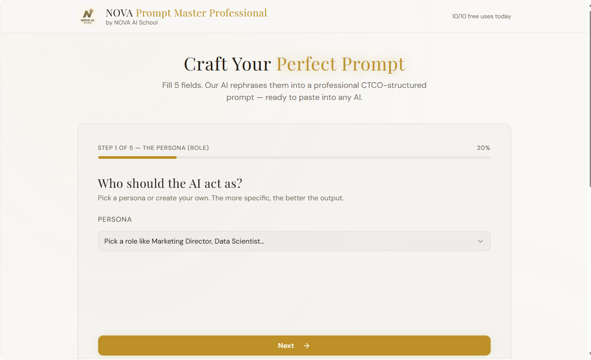

# 🎯 NOVA Prompt Master Professional
**The Logic-First Framework for High-Fidelity Model Alignment**

### 🚀 Overview
Built to bridge the gap between human intent and LLM performance, **NOVA Prompt Master Pro** is a rapid-prototype tool designed to standardize professional prompting. This application operationalizes the **P-CTCO framework**, a methodology I refined during my work on frontier LLM alignment (NVIDIA projects), to ensure models stay grounded, professional, and hallucination-free.

---

### 🧠 The Methodology: P-CTCO Anchoring
Most "shallow prompts" fail because they lack structural constraints. This tool enforces a 5-step alignment sequence:

1. **Persona Anchoring (The 'P'):** * *Logic:* By locking the model into a high-level expertise role (e.g., "Strategy Consultant" or "Senior Data Scientist") at Step 1, we narrow the probability space for more accurate responses.
2. **Contextual Grounding (The 'C'):** * *Logic:* Providing the "Mental Map" to ensure the AI understands the background environment.
3. **Task Definition (The 'T'):** * *Logic:* Direct, actionable instructions inspired by SFT (Supervised Fine-Tuning) principles.
4. **Constraint Enforcement (The 'C'):** * *Logic:* Implementing business-logic guardrails such as tone, length, and frameworks like SWOT or OKRs.
5. **Output Specification (The 'O'):** * *Logic:* Defining the final structure (Markdown, Tables, Executive Summaries) for immediate professional use.

---

### 🛠️ Technical Stack
* **Engine:** GPT-4o for complex reasoning and logic transformation.
* **Prototyping:** Developed using **Lovable** to demonstrate rapid AI-assisted tool deployment.
* **Logic Architecture:** Custom System Prompts designed to translate 5-field user input into a single, high-fidelity professional prompt.

---
### 🔗 [🚀 Click Here to Try the Live Tool](https://ai-master-script.lovable.app)

### 📸 Preview

---

### 👨‍💻 About the Author
**AI Research & Model Alignment Professional** Specializing in RLHF, SFT, and Multimodal VQA. ISB Certified in AI in Business. Expert at bridging technical engineering requirements with strategic business logic.

*“Using AI to build AI tools that align with human intent.”*
